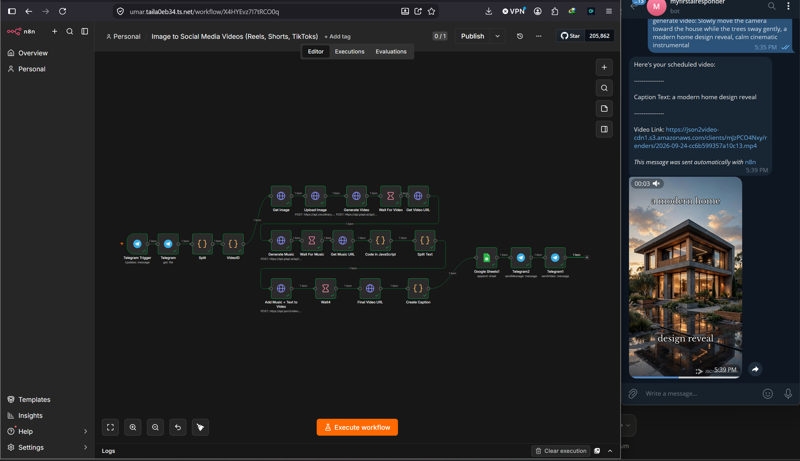

# Image to Social Media Video Automation
*n8n · Telegram · Cloudinary · PiAPI (Kling + DiffRhythm) · JSON2Video · Google Sheets*

> Send one photo and a one-line brief to a Telegram bot; get back a finished, captioned, music-scored vertical video for Reels, Shorts and TikTok, logged for scheduled posting.

**Demo video:** [[link](https://youtu.be/HdbkbPAYnCk)]

## Problem
Short-form video is the highest-reach content for small businesses and the most expensive to produce: animating, music licensing, copywriting, rendering, uploading. Most businesses post far less than they should because each video costs an hour.

## What it does
1. **Capture** – Telegram Trigger receives the photo and the message `generate video: [motion], [caption idea], [music style]`; the message is split into three prompts.
2. **Host** – the photo is re-uploaded to Cloudinary for a public URL.
3. **Animate** – PiAPI (Kling) turns the still into a 5-second 9:16 clip; the workflow waits and fetches the result.
4. **Score** – PiAPI (DiffRhythm) generates an original instrumental from the style prompt.
5. **Write** – an LLM writes a two-line hook/payoff overlay and a platform caption.
6. **Render** – JSON2Video merges clip, music (50% volume) and both text overlays into the final MP4.
7. **Deliver** – the video ID, caption and URL are appended to Google Sheets (for Buffer scheduling) and the video is sent back on Telegram.

## Files
- `image-to-social-video.json` – the workflow
- `screenshots/` – canvas, the Telegram request, the returned video

## Run it yourself
1. Import the JSON. 2. Add credentials: Telegram bot, Cloudinary (upload preset), PiAPI key (Header Auth), LLM key, JSON2Video key (`x-api-key`), Google Sheets. 3. Replace the `INSERT_` placeholders in the HTTP nodes. 4. Publish. 5. Send a photo with the brief format above.

## Cost
About $1–2.50 per finished video (Kling is the main cost). Self-hosted n8n and Cloudinary's free plan keep fixed costs at zero.

## Problems I solved
- Render APIs are asynchronous: Wait nodes plus polling calls for Kling, DiffRhythm and JSON2Video, each with its own timing.
- Telegram sends multiple photo sizes; the workflow selects the largest.
- Caption parsing by comma breaks if the brief contains commas; the split is order-based with a fallback.